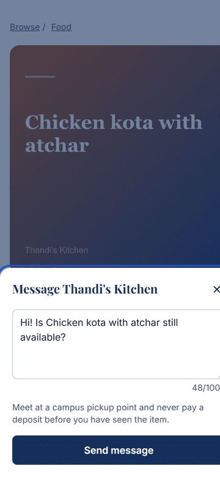
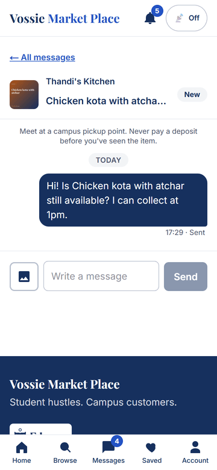
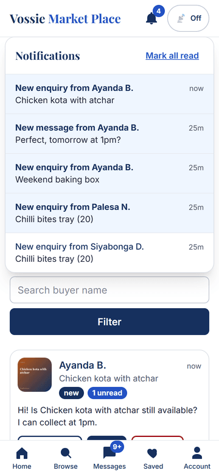
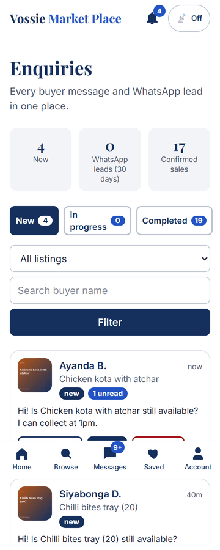
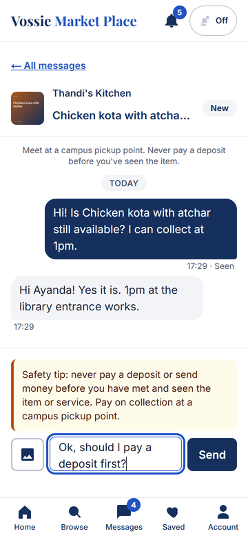
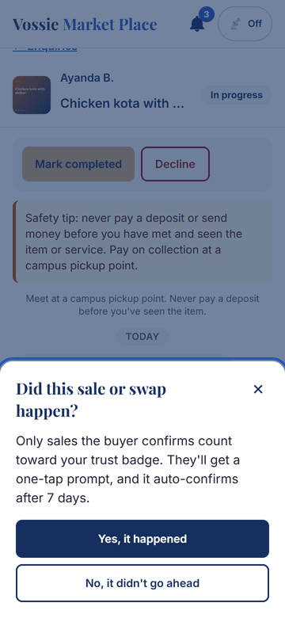
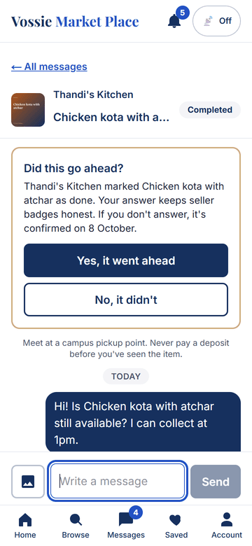
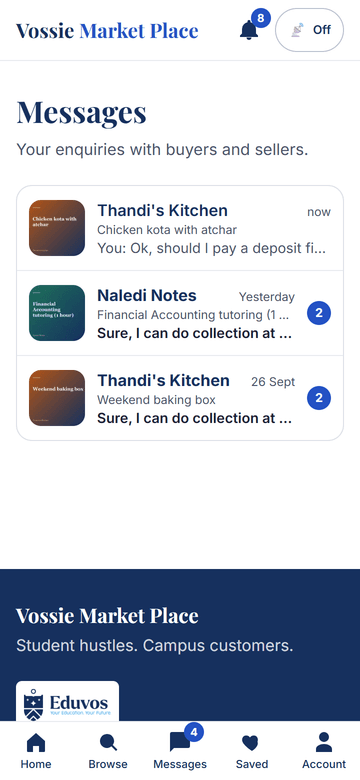
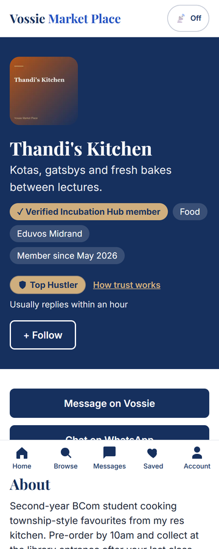
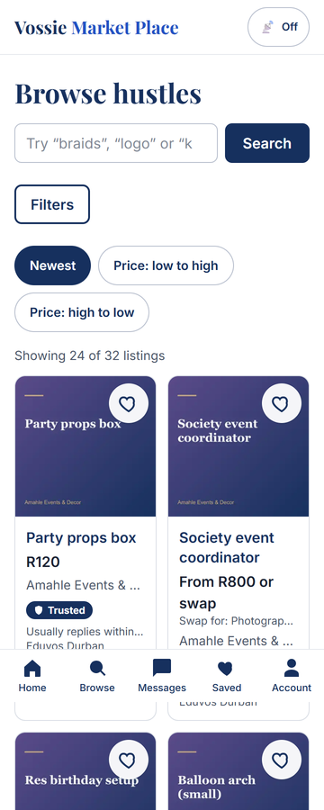

# Vossie Market Place

Student hustles. Campus customers. A multi-campus marketplace for Eduvos student entrepreneurs,
built for the Eduvos Hack Jam 2026 (Incubation Hub Marketplace).

## Setup
```bash
npm install
cp .env.example .env.local   # then fill in Supabase values
npm run dev                  # http://localhost:3000
```
Checks: `npm run lint`, `npm run typecheck`, `npm run build`. Health check: `GET /api/health`.

## Environment
| Variable | Exposure |
|---|---|
| `NEXT_PUBLIC_SUPABASE_URL` | browser |
| `NEXT_PUBLIC_SUPABASE_ANON_KEY` | browser |
| `SUPABASE_SERVICE_ROLE_KEY` | **server only** |

## Deploy
Live (team only, behind Vercel Authentication): **https://vossie-market-place.vercel.app**. Every push to `main` redeploys.
Vercel project `vossie-market-place`, functions pinned to Dublin (`vercel.json`) next to the Supabase project (eu-west-1).
Environment variables (Production and Preview): `NEXT_PUBLIC_SUPABASE_URL`, `NEXT_PUBLIC_SUPABASE_ANON_KEY`, `SUPABASE_SERVICE_ROLE_KEY` (sensitive, server only),
and for the team demo `DEMO_LOGIN_ENABLED=true` + `DEMO_PASSWORD`. **Only enable demo login while Deployment Protection is on**, and switch it off
(or remove the variable) once email sign-in works (`docs/EMAIL_SETUP.md`). Supabase > Authentication > URL Configuration must list the Vercel URL.

## Features
- **Phase 0:** PWA shell, brand tokens, responsive header / bottom nav / footer, health check.
- **Phase 1:** schema, RLS on every table, sign-up allow-list with POPIA consent, storage, seed data.
- **Phase 2:** email-code sign-in, seller onboarding wizard, seller dashboard and public profile,
  listing create/edit/manage with client-side image compression, first-time tours, seller guidelines.
- **Phase 3:** discovery: home, browse with filters and typo-tolerant search, listing pages, saved/follow, Featured Hustle rotation, low-data mode.
- **Phase 4 (MVP):** buyer-seller enquiries and realtime messaging, seller enquiry dashboard, buyer-confirmed completion, reply-time bands,
  trust badges (no stars) with a public explainer, notification bell, WhatsApp handoff logging.
- **Phase 5:** report/flag with auto-hide, admin panel (approvals, reports queue, moderation, config, users, audit log), suspensions and bans,
  mentor view with support flags and CSV, Hub Growth corner, POPIA privacy policy with data export and account deletion.
- **Theme:** light and dark mode (follows your device, one-tap toggle in the header, saved per browser, no flash on load).
- Planned: accessibility and onboarding polish, barter polish, Looking For board, payments (see CLAUDE.md).

## MVP tour (360px phone screenshots)
Captured from a real two-user run (`npm run test:flow`): a buyer enquires, the seller replies in realtime, completes the sale, and the buyer confirms.

| 1. Enquire | 2. Buyer thread | 3. Seller bell | 4. Seller dashboard |
|---|---|---|---|
|  |  |  |  |

| 5. Safety tip | 6. Did it happen? | 7. Buyer confirms | 8. Inbox |
|---|---|---|---|
|  |  |  |  |

| 9. Seller profile with trust badge | 10. Browse cards with badges |
|---|---|
|  |  |

GitHub can show the code and these screenshots but cannot run the app (it needs a server, Supabase and realtime).
To get a live URL, import this repo into Vercel and add the three environment variables above.

## Scripts
`npm run db:seed` (demo data, safe to rerun), `npm run test:rls`, `npm run test:messaging`, `npm run test:smoke`,
`npm run test:moderation`, `npm run test:theme`, `npm run test:ui`, `npm run test:flow` and `npm run test:phase5` (the last three need a production server: `npm run build && npx next start -p 3111`),
`npm run test:discovery` and `npm run db:audit` (need DATABASE_URL). Demo logins: set `DEMO_LOGIN_ENABLED=true` locally only.

## Two-phone test (about 5 minutes)
Run the app (`npm run build && npm start`) or use the deployed URL, with `DEMO_LOGIN_ENABLED=true`.
1. **Phone A (buyer):** open `/login`, tap "New student". Browse to *Thandi's Kitchen > Chicken kota with atchar*.
2. Tap **Message on Vossie**, edit the text, **Send**. You land in the thread.
3. **Phone B (seller):** `/login`, tap "Thandi's Kitchen". The bell shows a new enquiry; open **/sell/enquiries** (New tab) and open the chat.
4. Reply from B: it appears on A instantly, and B's message shows "Seen" once A has it open. Try typing "pay a deposit first" on A for the safety tip.
5. On B tap **Start**, then **Mark completed > Yes, it happened**. A sees "Did this go ahead?"; tap **Yes, it went ahead**.
6. Open `/s/thandis-kitchen` on either phone: the **Top Hustler** badge and "Usually replies within an hour" show; `/how-trust-works` lists the rules.
7. On A tap **Chat on WhatsApp**: B's dashboard counts it under "WhatsApp leads". Attach a photo from A's thread to check the private image.

## Phase 5 manual test (about 10 minutes, three browsers or phones)
Demo logins (with `DEMO_LOGIN_ENABLED=true`): **Admin (staff)**, **Mentor (staff)**, **Aisha (seller waiting for approval)**, **New student**, **Thandi's Kitchen**.
1. **Admin:** sign in, open **/admin**. Tap *Sellers waiting*, open *Aisha's Bakes*, tap **Approve**. **Aisha** (second browser) sees the approval in her bell and her profile at `/s/aishas-bakes` is live.
2. **Buyer (New student):** open Aisha's *Birthday cupcake box*, tap **Report this listing**, choose a reason, send. Reporting it again says you already did.
3. Two more reports (sign in as other demo buyers or use the script `npm run test:phase5`) hide the listing at 3 reporters; Aisha sees "Under review" and a notification that names nobody.
4. **Admin:** **/admin/reports**, open the report, **Dismiss**. The listing is restored and the three reporters are notified. **/admin/audit** shows every step.
5. **Admin > Users:** suspend flow lives in a report (Warn / Suspend / Ban). A suspended user sees a banner and cannot message.
6. **Mentor:** **/mentor** shows assigned sellers with flags (Lwazi Cuts needs support), open one to add a note and log a check-in, **Export CSV**. `/admin` is a 404 for the mentor.
7. **Hub:** **/growth** (anyone), RSVP to *Pitch Night*; as Thandi request an office-hours slot; as the mentor confirm it at **/growth/manage**.
8. **Privacy:** **/privacy**, then **/settings/privacy**: download your data, and (with a throwaway account) type DELETE to delete.

