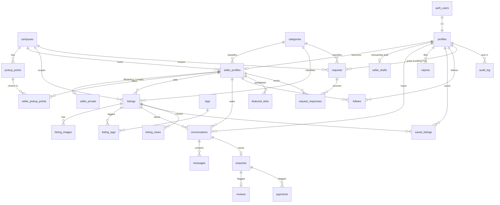

# Data Model

Source of truth: `supabase/migrations/`. Types: `src/types/database.ts` (regenerate with
`npx supabase gen types typescript --db-url $DATABASE_URL --schema public`).

## ER diagram

## Tables

| Table | Purpose |
|---|---|
| `campuses`, `categories`, `pickup_points`, `tags` | Reference data. Public read, admin write (tags: any signed-in user may add). |
| `allowed_email_domains`, `allowed_emails` | Sign-up allow-list (`vossie.net`, `eduvos.com`, plus named test addresses). Admin only. |
| `profiles` | One per auth user. Holds `role`, POPIA consent timestamp, onboarding flags, low-data preference. |
| `seller_profiles` | Business profile: slug, tagline, bio, photo, contact preference, `status`, `verified`, `mentor_id`. |
| `seller_private` | WhatsApp number (E.164, `+27` + 9 digits). Owner-only; server builds `wa.me` links. |
| `seller_pickup_points`, `seller_drafts` | Seller's 1-3 pickup points; multi-step onboarding draft. |
| `listings`, `listing_images`, `listing_tags` | Products and services (cash / swap / both), up to 5 images and 5 tags. Soft delete via `deleted_at`. |
| `conversations`, `messages`, `enquiries` | Buyer-seller chat and status (new / in_progress / completed). |
| `reports`, `audit_log`, `feature_flags` | Moderation, admin audit trail, feature toggles. |
| `featured_slots`, `saved_listings`, `follows`, `listing_views` | Engagement and Featured Hustle rotation. |
| `requests`, `request_responses` | "Looking For" board. |
| `reviews`, `payments` | Schema only; behind feature flags (Phase 8). |

## Roles

`buyer` (default), `seller` (set automatically when an admin approves a seller), `mentor`, `admin`.
Roles are only changed by an admin or the service role (trigger `guard_profile`). Being on an allowed
domain never grants a role.

## RLS summary

- RLS is enabled on **every** public table. Helper functions live in the un-exposed `private` schema
  (`is_admin`, `owns_seller`, `seller_approved`, `listing_visible`, `in_conversation`, ...).
- **Public**: approved sellers, and listings of approved sellers that are not deleted/hidden, with their
  images and tags; campuses, categories, pickup points, feature flags.
- **Owner**: own profile, drafts, WhatsApp number, own seller profile and listings (even while pending).
- **Admin**: full access to moderation tables and everything else.
- **Mentor**: read-only on sellers assigned to them (and their listings).
- **Guard triggers** (defence in depth): sellers cannot change `verified`, `mentor_id`, `approved_at`, or
  approval `status` (except draft/rejected to pending); `slug` is editable once; 20 listings per seller
  per day; max 5 images/tags per listing; max 3 pickup points, which must be approved and on the seller's
  campus; a listing's pickup point must be one of the seller's own.
- **Sign-up gate** (`gate_signup` on `auth.users`): email domain/address must be allow-listed and POPIA
  consent metadata must be `true`; consent time is stored in `profiles.popia_consent_at` (immutable).
- **Storage**: `avatars` (512 KB) and `listing-images` (1 MB), webp/jpeg/png only, public read by URL, writes
  restricted to the `{user_id}/` folder. There is no anonymous listing policy, so buckets cannot be enumerated.

## Verification

- `node --env-file=.env.local scripts/rls-test.mjs` runs 30 automated checks (cross-user writes, privilege
  escalation, private data, visibility, sign-up gate, storage isolation).
- `DATABASE_URL=... node scripts/db-audit.mjs` approximates the Supabase advisors (RLS coverage, exposed
  functions, search paths, unindexed FKs, unwrapped `auth.uid()`). Last run: 0 flagged.
