# Data Model

Source of truth: `supabase/migrations/`. Types: `src/types/database.ts` (regenerate with
`npx supabase gen types typescript --db-url $DATABASE_URL --schema public`).

## ER diagram

```mermaid
erDiagram
  campuses ||--o{ pickup_points : has
  campuses ||--o{ seller_profiles : hosts
  campuses ||--o{ listings : "scopes"
  campuses ||--o{ requests : "scopes"
  categories ||--o{ seller_profiles : classifies
  categories ||--o{ listings : classifies
  categories ||--o{ requests : classifies
  auth_users ||--|| profiles : "1:1"
  profiles ||--o| seller_profiles : "becomes"
  profiles ||--o| seller_drafts : "onboarding draft"
  seller_profiles ||--o| seller_private : "WhatsApp (private)"
  seller_profiles ||--o{ seller_pickup_points : offers
  pickup_points ||--o{ seller_pickup_points : "chosen in"
  seller_profiles ||--o{ listings : sells
  listings ||--o{ listing_images : has
  listings ||--o{ listing_tags : tagged
  tags ||--o{ listing_tags : ""
  profiles ||--o{ conversations : "buyer"
  seller_profiles ||--o{ conversations : "seller"
  listings ||--o{ conversations : about
  conversations ||--o{ messages : contains
  conversations ||--o| enquiries : tracks
  enquiries ||--o{ enquiry_events : logs
  seller_profiles ||--o{ quick_replies : saves
  seller_profiles ||--o| seller_trust : "score (server-written)"
  trust_tiers ||--o{ seller_trust : defines
  profiles ||--o{ notifications : receives
  profiles ||--o| notification_prefs : sets
  profiles ||--o{ email_queue : queued
  profiles ||--o{ push_subscriptions : registers
  reports ||--o{ report_context : "message snapshot"
  profiles ||--o{ user_warnings : warned
  seller_profiles ||--o{ mentor_notes : "private notes"
  seller_profiles ||--o{ mentor_checkins : "check-ins"
  hub_posts ||--o{ hub_rsvps : "RSVPs"
  hub_posts ||--o{ hub_bookings : "office-hours requests"
  profiles ||--o{ hub_posts : "staff author"
  enquiries ||--o| reviews : "flagged"
  enquiries ||--o{ payments : "flagged"
  profiles ||--o{ reports : files
  profiles ||--o{ saved_listings : saves
  listings ||--o{ saved_listings : ""
  profiles ||--o{ follows : follows
  seller_profiles ||--o{ follows : ""
  seller_profiles ||--o{ featured_slots : spotlighted
  listings ||--o{ listing_views : viewed
  profiles ||--o{ requests : "posts (Looking For)"
  requests ||--o{ request_responses : receives
  seller_profiles ||--o{ request_responses : sends
  profiles ||--o{ audit_log : "acts in"
```

## Tables

| Table | Purpose |
|---|---|
| `campuses`, `categories`, `pickup_points`, `tags` | Reference data. Public read, admin write (tags: any signed-in user may add). |
| `allowed_email_domains`, `allowed_emails` | Sign-up allow-list (`vossie.net`, `eduvos.com`, plus named test addresses). Admin only. |
| `profiles` | One per auth user. Holds `role`, POPIA consent timestamp, onboarding flags, low-data preference. |
| `seller_profiles` | Business profile: slug, tagline, bio, photo, contact preference, `status`, `verified`, `mentor_id`. |
| `seller_private` | WhatsApp number (E.164, `+27` + 9 digits). Owner-only; server builds `wa.me` links. |
| `seller_pickup_points`, `seller_drafts` | Seller's 1-3 pickup points; multi-step onboarding draft. |
| `listings`, `listing_images`, `listing_tags` | Products and services (cash / swap / both), up to 5 images and 5 tags. Soft delete via `deleted_at`. |
| `conversations` | One per (buyer, seller, listing); seller-level chat (no listing) is one per pair. Snapshots buyer/seller names and listing title/cover, last-message preview, `origin` (in_app / whatsapp). |
| `messages` | Text (max 1000), optional private image path, `kind` text or swap_offer, scam-pattern `risk_flag`, `read_at` (seen). Realtime. |
| `enquiries` | One per conversation, created by trigger. Status new / in_progress / completed / declined, `source`, `first_response_at`, `sale_happened`, buyer confirm/dispute timestamps, `auto_confirmed`. |
| `enquiry_events` | Audit trail: status changes, completion request/confirm/dispute/auto-confirm, `whatsapp_handoff`. Written by triggers or the service role only. |
| `quick_replies` | Up to 5 canned seller replies. |
| `notifications` | In-app bell. Server-created only; the owner may only set `read_at`. Realtime. |
| `notification_prefs`, `email_queue`, `push_subscriptions` | Email/digest/push preferences, an email outbox (no sender connected yet) and web-push subscriptions (flag off). |
| `reports`, `report_context`, `user_warnings` | Reports against a listing, seller, user or message (7 reasons, one open per reporter and target, 10 a day). A message report snapshots the message and up to 5 around it (`report_context`, admin-only). Warnings sent by admins. |
| `site_settings` | Admin-editable: auto-hide threshold, POPIA Information Officer, policy version. Public read. |
| `mentor_notes`, `mentor_checkins` | A mentor's private notes and check-ins for an assigned seller. |
| `hub_posts`, `hub_rsvps`, `hub_bookings` | Hub Growth corner: tips, events (capacity, RSVPs) and mentor office hours (booking requests). Cover images in the public `hub-covers` bucket. |
| `trust_tiers` | Admin-editable badge rules (min enquiries, response rate, confirmed sales, account age, verified). Public read. |
| `seller_trust` | Computed tier, response rate, confirmed sales and reply-time band per seller. Public read for approved sellers; **no client write policy or privilege**. |
| `reports`, `audit_log`, `feature_flags` | Moderation, admin audit trail, feature toggles. |
| `featured_slots`, `saved_listings`, `follows`, `listing_views` | Engagement and Featured Hustle rotation. |
| `requests`, `request_responses` | "Looking For" board. |
| `reviews`, `payments` | Schema only; behind feature flags (Phase 8). |

## Roles

`buyer` (default), `seller` (set automatically when an admin approves a seller), `mentor`, `admin`.
Roles are only changed by an admin or the service role (trigger `guard_profile`). Being on an allowed
domain never grants a role.

## RLS summary

- RLS is enabled on **every** public table. Helper functions live in the un-exposed `private` schema
  (`is_admin`, `owns_seller`, `seller_approved`, `listing_visible`, `in_conversation`, ...).
- **Public**: approved sellers, and listings of approved sellers that are not deleted/hidden, with their
  images and tags; campuses, categories, pickup points, feature flags.
- **Owner**: own profile, drafts, WhatsApp number, own seller profile and listings (even while pending).
- **Admin**: full access to moderation tables and everything else.
- **Mentor**: read-only on sellers assigned to them (and their listings).
- **Guard triggers** (defence in depth): sellers cannot change `verified`, `mentor_id`, `approved_at`, or
  approval `status` (except draft/rejected to pending); `slug` is editable once; 20 listings per seller
  per day; max 5 images/tags per listing; max 3 pickup points, which must be approved and on the seller's
  campus; a listing's pickup point must be one of the seller's own.
- **Sign-up gate** (`gate_signup` on `auth.users`): email domain/address must be allow-listed and POPIA
  consent metadata must be `true`; consent time is stored in `profiles.popia_consent_at` (immutable).
- **Messaging**: conversations, messages and enquiries are readable only by the buyer, the seller's owner and admins (moderation). Mentors have no
  policy on message content. Guard triggers: no self-messaging, message edits limited to the recipient setting `read_at` once, sellers move enquiries
  only new -> in_progress -> completed/declined (completing needs a yes/no), buyers may only confirm or dispute a completed sale once, timestamps and
  `source` are immutable. Rate limits: 30 messages/min per user, 10 new conversations/hour. "System" changes are recognised by
  `auth.uid() is null or pg_trigger_depth() > 1`.
- **Trust**: `seller_trust` is written only by SECURITY DEFINER functions (`private.refresh_seller_trust`), run on every enquiry/verification change
  and nightly (pg_cron `trust-refresh`); `private.auto_confirm_completions` runs nightly (`enquiry-auto-confirm`). Response rate = in-app enquiries from
  the last 90 days answered within 48h / those old enough to judge; WhatsApp-sourced enquiries are excluded. Reply band = median first response over
  30 days (needs 3+ enquiries): <= 1h, <= 6h, <= 24h, else slow.
- **Storage**: `avatars` (512 KB) and `listing-images` (1 MB), webp/jpeg/png only, public read by URL, writes
  restricted to the `{user_id}/` folder. `message-images` (512 KB) is **private**: path `{conversation_id}/{user_id}/{message_id}.webp`, readable and
  uploadable only by the conversation's participants (signed URLs). There is no anonymous listing policy, so buckets cannot be enumerated.

## Phase 5: moderation, admin, mentors, POPIA

- **Reports**: inserting a report fills `target_owner_id`, enforces 10/day (`rate_limit_reports`) and the one-open-report index, and for messages snapshots
  the context. When unique reporters pending on a listing reach `site_settings.auto_hide_threshold` (3) the listing is hidden (`moderation_hidden_reason =
  'auto'`) and the seller is notified, without any reporter detail. Resolving a report notifies every reporter. Reporters are `set null` on deletion.
- **Suspension, ban, deletion**: `profiles.suspended_until / banned_at / deleted_at`. `private.is_blocked()` hides a blocked owner's seller profile and
  listings (policies, `seller_approved()`, `browse_listings`) and `guard_not_blocked` stops them creating listings, conversations or messages. A ban also
  blocks sign-in (auth ban set by the server). Users cannot edit these fields or undo a deletion.
- **Audit log**: columns `before`, `after`, `reason`. Triggers make it append-only for every role; the only permitted change is clearing `actor_id` when an
  account is removed. Admin actions are SECURITY INVOKER SQL functions (`admin_review_seller`, `admin_set_verified`, `admin_moderate_listing`,
  `admin_resolve_report`, `admin_unsuspend`, `admin_set_role`, `admin_assign_mentor`) that check the admin role, change the data and write the audit row in
  one transaction. Edits to categories, campuses, pickup points, flags, allowed emails/domains, tiers, featured slots and settings are audited by trigger.
- **Last admin**: `guard_last_admin` blocks demoting, banning, soft-deleting or deleting the only active admin (also for the service role).
- **Messages and admins**: admins have no blanket message access any more; they read only `report_context` snapshots.
- **Mentors**: `seller_trust` gained activity columns (enquiries, WhatsApp handoffs, views, last active, last listing update, recently hidden). Mentors read
  them only for assigned sellers. They have no policy on messages, conversations or enquiries.
- **Account deletion**: soft delete triggers `profile_scrub` (names, email, WhatsApp number, seller profile text, saved items, notifications cleared; listings
  deleted; conversation names become "Deleted user"; audit actor anonymised). `hard_delete_accounts` (pg_cron, 00:45) removes the login after 30 days.
  `messages.sender_id`, `conversations.buyer_id`, `enquiries.buyer_id`, `seller_profiles.user_id`, `reports.reporter_id` and `payments.buyer_id` are now `ON
  DELETE SET NULL` so other people's history survives.

## Verification

- `npm run test:moderation` runs 161 checks (reports, auto-hide, admin authorisation, suspension, audit immutability, last admin, approvals, mentors, Hub, deletion).
- `npm run test:phase5` drives admin, mentor, buyer, seller and a throwaway user through the Phase 5 flows in a real browser at 360px.

- `npm run test:messaging` runs 83 checks on conversations, messages, enquiry rules, trust, notifications, quick replies, private images and rate limits.
- `npm run test:flow` drives a two-user flow in a real browser at 360px.
- `node --env-file=.env.local scripts/rls-test.mjs` runs 30 automated checks (cross-user writes, privilege
  escalation, private data, visibility, sign-up gate, storage isolation).
- `DATABASE_URL=... node scripts/db-audit.mjs` approximates the Supabase advisors (RLS coverage, exposed
  functions, search paths, unindexed FKs, unwrapped `auth.uid()`). Last run: 0 flagged.
